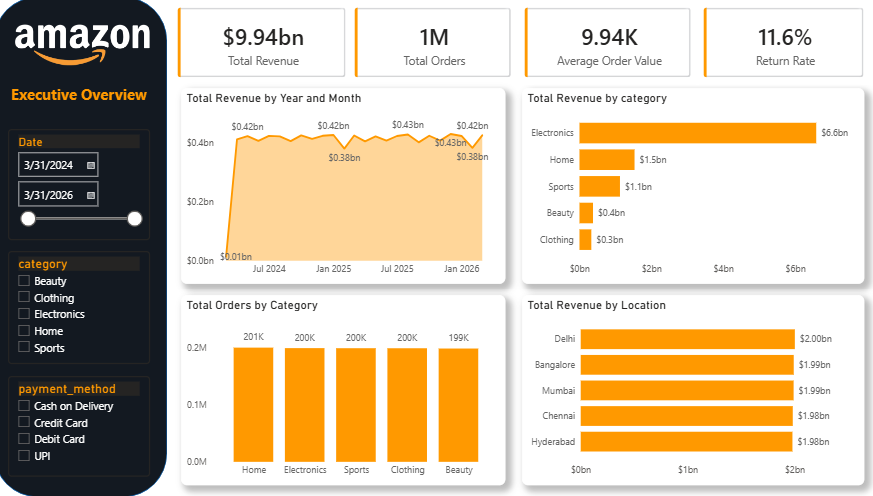
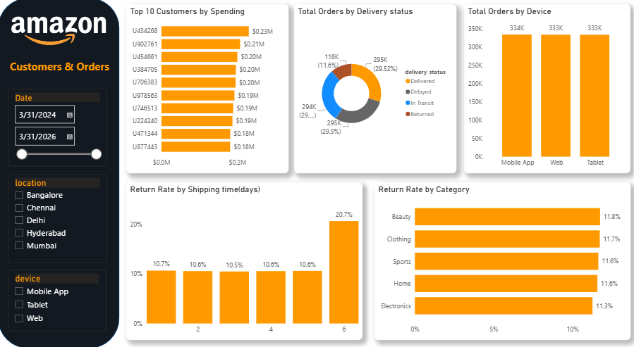
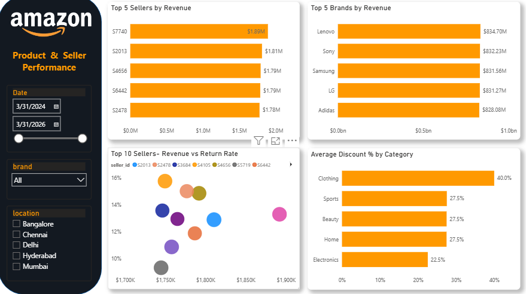
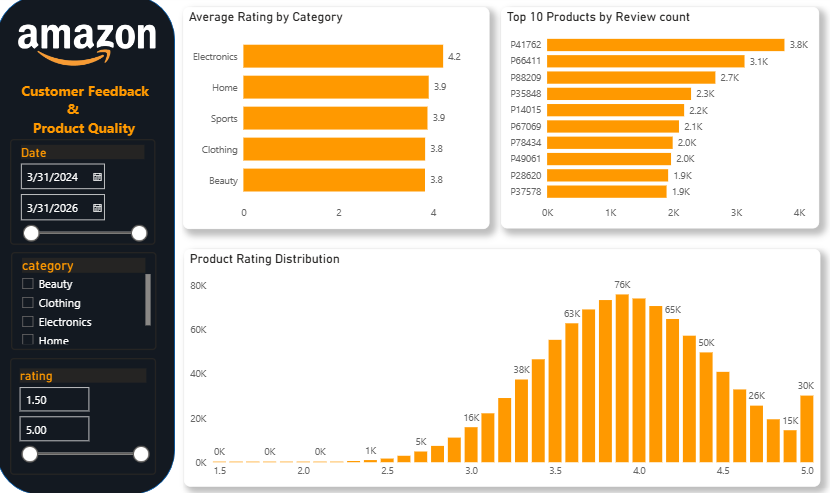

# Amazon_Ecommerce_Analytics
Explored 1M+ Amazon e-commerce records to assess sales performance, customer behavior, product trends, seller performance, and customer satisfaction. Applied Python, PostgreSQL, and Power BI to derive meaningful insights and support data-driven business decision-making.

---

## 📌 Project Overview

An end-to-end **Amazon E-Commerce Analytics** project using **Python, PostgreSQL, and Power BI** to analyze **1M+ e-commerce records** and evaluate key business performance areas.

The project focuses on transforming raw e-commerce data into meaningful business insights by analyzing **sales trends, customer and order behavior, product and seller performance, and customer feedback** to identify growth opportunities and performance drivers.

---

## 📊 About the Dataset

The dataset contains **1,000,000 transaction records** and **20 attributes** covering product details, pricing and discounts, customer and order information, seller performance, delivery status, and customer feedback.

### Key Variable Groups

| Category | Columns |
|---|---|
| **Product Info** | `product_id`, `category`, `subcategory`, `brand` |
| **Pricing** | `price`, `discount`, `final_price` |
| **Customer & Order** | `user_id`, `purchase_date`, `device`, `payment_method`, `location` |
| **Seller** | `seller_id`, `seller_rating`, `stock` |
| **Delivery & Returns** | `shipping_time_days`, `delivery_status`, `is_returned` |
| **Feedback** | `rating`, `review_count` |

---

## 📂 Dataset Source

- **Source:** Kaggle
- **Dataset:** Amazon E-commerce
- **Dataset Link:** https://www.kaggle.com/datasets/sharmajicoder/amazon-e-commerce

---

## 🛠️ Tools & Technologies

- **Python** – Data cleaning and data quality checking using Pandas and NumPy
- **PostgreSQL** – Data storage, SQL-based querying, and business-focused data analysis
- **Power BI** – Interactive dashboard development and visualization of key business insights

---

## 🔄 Project Workflow

### 1. Data Loading

The dataset was loaded into Python using Pandas for initial inspection and analysis.

**Key activities:**

- Understanding the dataset structure
- Checking rows and columns
- Inspecting data types
- Identifying missing values
- Understanding categorical and numerical variables

### 2. Data Cleaning & Preprocessing

The dataset was prepared for analysis by:

- Checking duplicate records
- Correcting data types
- Standardizing categorical data

### 3. PostgreSQL Analysis

The cleaned dataset was loaded into PostgreSQL for structured querying and deeper analysis.

The SQL analysis focused on business questions such as:

- What is the overall business performance in terms of total revenue, total orders, average order value, unique customers, unique products, and return rate?
- Which categories generate the most revenue?
- Which categories receive the most orders?
- How does revenue change over time?
- What are the top 10 products by revenue?
- Which categories have the highest return rates?
- Does shipping time relate to returns?
- Which payment methods are most popular?
- Which locations generate the most revenue?
- What is the average discount percentage for each category?
- Which sellers perform best?

### 4. Dashboard Development

The analyzed data was connected to Power BI to create an interactive dashboard containing **KPIs, charts, slicers, and business-focused visualizations**.

---

# 📈 Power BI Dashboard Pages

The Power BI report contains four analytical pages, each focusing on a different aspect of e-commerce performance.


## 1. 📊 Executive Overview

Provides a high-level view of overall e-commerce performance through key business KPIs and trends.

**Key Areas:**

Revenue, Orders, Average Order Value,Revenue Trends, Category Performance, Location, and Payment Methods.



---

## 2. 👥 Customers & Orders

Analyzes customer value, ordering behavior, device usage, returns, shipping time, and order status.

**Key Areas:**

High-Value Customers, Device Usage, Order Value, Return Rate, Shipping Time, and Order Status.



---

## 3. 📦 Product & Seller Performance

Evaluates product, category, brand, and seller performance to identify major revenue contributors and areas requiring attention.

**Key Areas:**

Product Revenue, Seller Revenue, Brand Performance, Product Ratings, Seller Return Rate, and Category Discounts.



---

## 4. ⭐ Customer Feedback

Analyzes customer ratings and review activity to understand product satisfaction and feedback patterns.

**Key Areas:**

Average Rating by Category, Top 10 Products by Review Count, and Product Rating Distribution.



---

## 💡 Key Insights

- 💰 Total revenue analyzed was approximately **$9.94B**.
- 🛍️ The analysis covered **1M+ orders/records**.
- 📱 **Electronics** was the leading category, generating approximately **$6.6B** in revenue.
- 📦 **Lenovo** was among the strongest-performing products/brands, generating approximately **$834.70M** in revenue.
- 📍 **Delhi** was one of the highest-revenue locations, contributing approximately **$2.00B**.
- 🔄 The overall return rate was approximately **11.6%**.
- ⭐ Customer ratings and review volumes were analyzed to evaluate product satisfaction and feedback patterns.
  
---

## 📁 Project Structure

```text
Amazon-E-Commerce-Analytics/
│
├── dashboard-screenshots/
│   ├── executive-overview.png
│   ├── customers-orders.png
│   └── product-seller.png
│
├── Amazon_E-commerce_Analytics(data quality checking).ipynb
├── Amazon_E-commerce_Analytics_Dashboard.pdf
├── Amazon_E-commerce_Analytics_SQL.sql
└── README.md
```
```text
📦 GitHub Releases
├── Raw Dataset
│   └── Original Amazon E-commerce dataset
│
└── Clean Dataset
    └── Cleaned Dataset Used for Analysis
```
---

## 👨‍💻 Author

**Surjatapa Mukherjee**

Aspiring Data Analyst | Advanced Excel | SQL | Power BI | Python

---
## 🤝 Support

If you find this project useful, please consider giving the repository a ⭐ **Star**.

Feedback and suggestions are always welcome.
